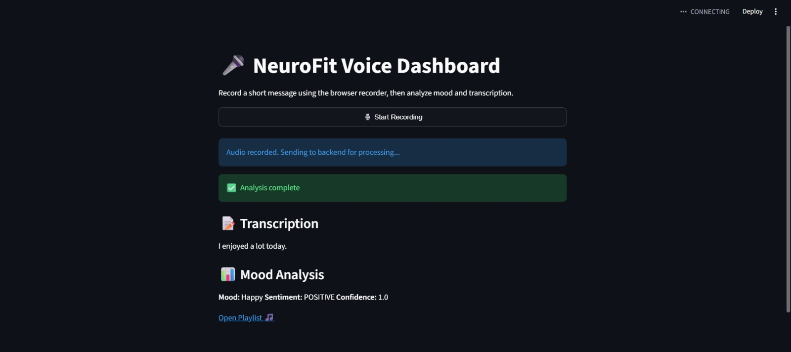

# 🧠 NeuroFit — Real-Time Voice-Based Mood Detection & Wellness Dashboard

NeuroFit is a real-time mental wellness web app that analyzes your voice to detect your emotional state and visualizes it on an interactive dashboard. Built with ML, Web, and Cloud technologies as a collaborative project.

---

## 📸 Live Demo



---

## 🎯 What It Does

- 🎙️ Captures **voice input** directly from the browser
- 📝 Transcribes speech using **OpenAI Whisper** (with Vosk fallback for edge cases)
- 🤖 Classifies emotional state using **DistilBERT** fine-tuned on SST-2
- 📊 Displays transcription, mood, confidence score on a **real-time dashboard**
- 🎵 Recommends a **Spotify playlist** matched to your detected mood

---

## 🏗️ Architecture
```
Voice Input (Browser)
        ↓
Whisper (Speech-to-Text) → Vosk fallback if empty
        ↓
DistilBERT (Sentiment → Mood Classification)
        ↓
Flask Backend (REST API — /analyze)
        ↓
Streamlit Frontend (Dashboard + Spotify link)
```
---

## 🛠️ Tech Stack

| Layer | Technology |
|---|---|
| Speech-to-Text | OpenAI Whisper (base) + Vosk fallback |
| Mood Classification | DistilBERT fine-tuned on SST-2 (Hugging Face) |
| Backend | Flask + Flask-CORS |
| Frontend | Streamlit + streamlit-mic-recorder |
| Audio Handling | tempfile, WAV validation |
| Version Control | Git + GitHub |

---

## 📁 Project Structure
```
NeuroFit-Project/
├── backend/
│   └── app.py                    # Flask API — /analyze POST endpoint
├── frontend/
│   └── dashboard.py              # Streamlit dashboard UI
├── ml_model/
│   └── whisper_mood_pipeline.py  # Whisper + DistilBERT + mood mapping
├── data/
├── requirements.txt
└── README.md
```
---

## ⚙️ How It Works

1. User clicks **Start Recording** in the browser
2. `streamlit-mic-recorder` captures audio and sends bytes to the frontend
3. Frontend POSTs the WAV file to Flask at `/analyze`
4. Flask validates the file, writes to a temp path, calls `process_audio_file()`
5. Whisper transcribes the audio → text
6. If Whisper returns empty, Vosk fallback is attempted
7. DistilBERT runs sentiment analysis on the transcript
8. Sentiment maps to mood label + Spotify playlist URL
9. Flask returns JSON → Streamlit renders the result

---

## 🧪 Models Used

**Whisper** (`openai/whisper-base`)
- Speech-to-text transcription from raw browser audio
- Chosen for speed on CPU + accuracy across accents

**DistilBERT** (`distilbert-base-uncased-finetuned-sst-2-english`)
- Sentiment classification: POSITIVE → Happy, NEGATIVE → Sad
- 40% smaller than BERT, retains 97% of performance

**Vosk** (fallback)
- Lightweight offline ASR — triggered only when Whisper returns empty

---

## 🚀 Running Locally

```bash
# 1. Install dependencies
pip install -r requirements.txt

# 2. Start the Flask backend
python backend/app.py

# 3. In a new terminal, start the Streamlit frontend
streamlit run frontend/dashboard.py
```

Open `http://localhost:8501` in your browser.

---

## 👥 Team

| Name | Role | GitHub |
|---|---|---|
| Diya Bangad | ML + Backend | [@diyabangad](https://github.com/diyabangad) |
| Digvijay Nandan | Frontend | [@digvijaynandan](https://github.com/digvijaynandan) |

---

## 🚧 Roadmap

- [ ] Firebase integration for mood history and trend analytics
- [ ] Real-time audio streaming instead of recorded clips
- [ ] Dedicated multi-class emotion classifier (beyond positive/negative)
- [ ] Multilingual support via Whisper large model
- [ ] Mobile-responsive UI
- [ ] Export mood session reports as PDF
